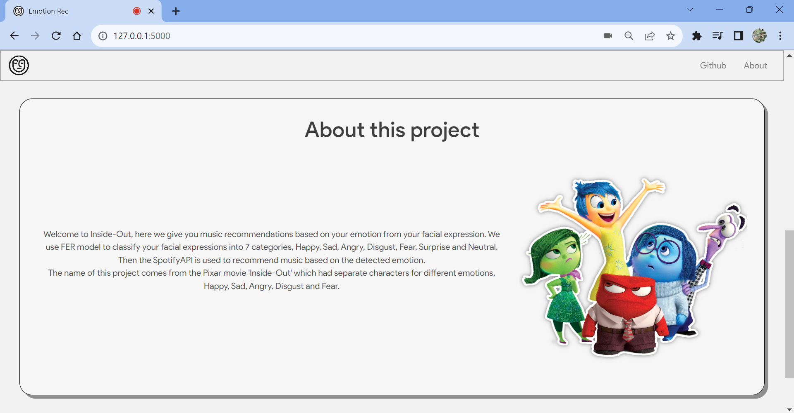

# Music Recommendation by Facial Emotion Detection using FER, SpotifyAPI, Flask, OpenCV2

<!-- PROJECT LOGO -->
<br />
<div align="center">
    
        
    <h1 align="center">Inside-Out</h1>

</div>

Inside-Out is a web application that uses FER library, OpenCv's Haarcascades to detect faces and their emotion. Music is recommended using Spotify API. The website uses Python, Flask, SocketIO, HTML, CSS &amp; JS.

Inside-Out detects 7 emotions - 
<b>
- Neutral
- Happy
- Sad
- Disgust
- Fear
- Angry
- Surprise
</b>

<h2 align="center">Video Demo</h2>

[](https://youtu.be/TuBorWjBrAw "InsideOut Video Presentation")

## Screenshots





#
## Setup & Use

- Clone the repository
```sh
git clone https://github.com/priyanka-maz/music-recommendation-facial-emotion.git
```

- Install requirements

```sh
cd music-recommendation-facial-emotion
pip install -r requirements.txt
```


- Go to https://developer.spotify.com/dashboard > Create app (fill the details and submit) > Settings

- Copy ClientID and ClientSecret, paste it in **.env**

- Run ```app.py```

#
## Spotify API

1. Once the emotion is detected, the Spotify API [**```/recommendations```**](https://developer.spotify.com/documentation/web-api/reference/get-recommendations) endpoint is used to obtain the recommended tracks.
###

2. Some of the parameters the endpoint takes are *seed_genres, seed_artists, danceability, energy, loudness, acousticness, valence, tempo* etc.
###
3. Specific emotions corelate to specific parameter values. 
###
4. The parameter values for each emotion was determined by feeding tracks from preexisting playlists (of that particular emotion type) into another Spotify API endpoint [**```/audio-features```**](https://developer.spotify.com/documentation/web-api/reference/get-audio-features)
###
5. The parameter values evaluation is performed in [**```spotifyplaylists.ipynb```**](spotifyplaylist.ipynb)

> [!NOTE]
> Make sure you change the *client_id* and *client_secret* before running the notebook.
##
Learn more about Spotify API endpoints [```Spotify Web API```](https://developer.spotify.com/documentation/web-api)


